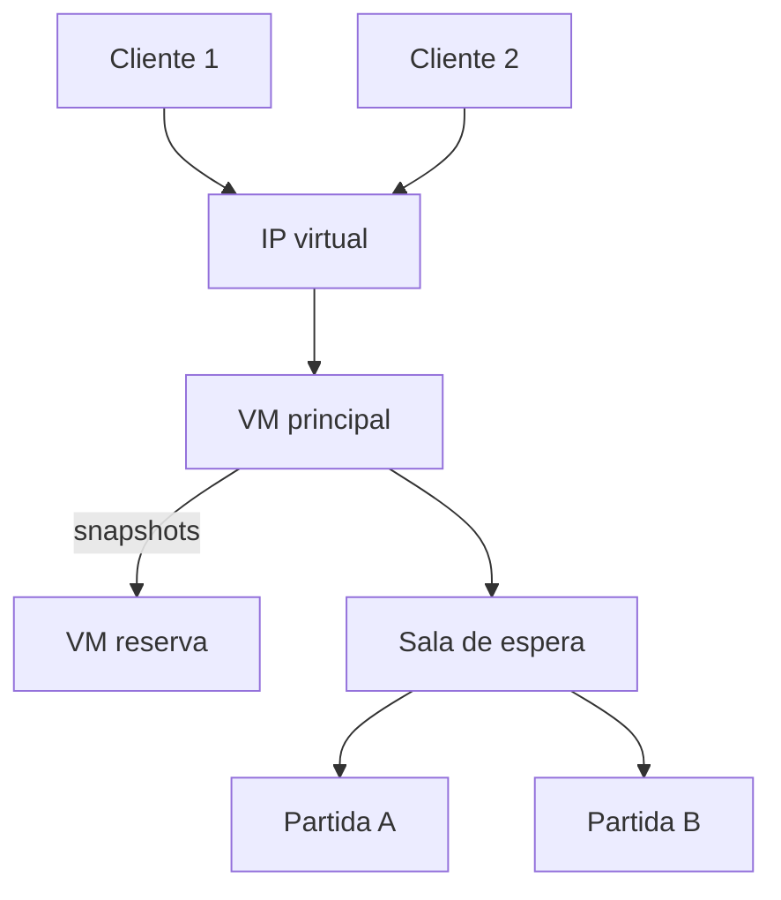

# Relatório técnico — Jogo da Forca Distribuído

## 1. Objetivo

O sistema implementa um jogo da forca em arquitetura cliente/servidor. Vários jogadores podem se conectar ao mesmo servidor, mas cada partida possui apenas duas pessoas. O servidor é a autoridade sobre palavra, turno, letras usadas, erros e resultado, impedindo que os clientes alterem o estado localmente.

## 2. Arquitetura

O Keepalived anuncia o IP virtual na VM principal. Se ela parar, a VM reserva passa a anunciar o mesmo endereço. Como conexões TCP abertas não migram entre máquinas, o cliente possui reconexão automática. O token recebido no primeiro acesso identifica o jogador e permite ligá-lo à partida replicada.

## 3. Componentes

### Servidor

`GameServer` aceita conexões, mantém jogadores por token e executa a sala de espera. Cada cliente é atendido por uma tarefa do `ExecutorService`.

`BlockingQueue<Player>` funciona como fila segura entre threads. O emparelhador retira dois jogadores conectados e cria uma `GameSession`.

### Partida

A partida armazena:

- palavra secreta;
- dois jogadores e seus tokens;
- contador de erros de cada jogador;
- letras já utilizadas;
- jogador da vez;
- situação e vencedor;
- versão monotônica do estado.

O método `guess` chama `semaphore.acquire()` antes de validar e modificar qualquer dado. O bloco `finally` sempre chama `semaphore.release()`. Mesmo se duas requisições chegarem juntas por threads distintas, a região crítica é executada por apenas uma delas de cada vez.

### Cliente

O `GameLauncher.java` oferece uma interface Swing com dois modos. No online, dois clientes gráficos reais entram na sala de espera. No solo, o programa conecta o humano e inicia um `BotClient` como segundo cliente. Ambos utilizam o mesmo protocolo TCP. Ao receber `STATE`, a interface redesenha palavra, letras utilizadas, os dois bonecos e a indicação do turno.

O banco de palavras contém 156 opções em 13 categorias. Palavra e categoria são escolhidas no servidor, incluídas no snapshot de replicação e enviadas aos clientes. A interface também apresenta perfis visuais; uma jogada correta aciona temporariamente um emoji no perfil do autor do acerto.

O bot não acessa diretamente a `GameSession`: ele recebe estados e envia `GUESS` pelo socket. Portanto, a região crítica do semáforo, o limite de dois jogadores e as validações de turno continuam sendo exercitados no modo solo.

## 4. Protocolo

O protocolo é textual, com uma mensagem por linha. Textos livres são codificados em Base64 URL-safe para que nomes, espaços e acentos não quebrem o separador `|`.

| Direção | Mensagem | Finalidade |
|---|---|---|
| cliente → servidor | `HELLO|nomeBase64|token` | entrar ou reconectar |
| servidor → cliente | `WELCOME|token|NEW` | entregar identidade |
| servidor → cliente | `WAITING|posição` | informar sala de espera |
| cliente → servidor | `GUESS|letraBase64` | enviar jogada |
| cliente → servidor | `WORD|palavraBase64` | tentar a palavra completa |
| cliente → servidor | `REPLAY` | solicitar uma revanche |
| servidor → ambos | `STATE|...` | sincronizar toda a partida |
| cliente → servidor | `QUIT` | sair |
| principal → reserva | `SYNC|segredo|snapshot` | replicar estado |

## 5. Regras da partida

1. O primeiro jogador retirado da fila começa.
2. Somente uma letra inédita é aceita por jogada.
3. Após uma jogada válida, o turno passa ao adversário.
4. Um acerto revela a letra compartilhada da palavra.
5. Um erro acrescenta uma parte somente ao boneco de quem errou.
6. Ambos os clientes visualizam os dois bonecos.
7. Descobrir a última letra vence a partida.
8. Chegar a seis erros dá a vitória ao adversário.
9. Uma tentativa de palavra completa correta vence; uma incorreta soma um erro e alterna o turno.
10. Uma revanche começa quando os dois jogadores enviam `REPLAY`, criando uma nova sessão zerada.

## 6. Resiliência

Após cada mudança, o principal envia um snapshot ao reserva. O snapshot inclui a palavra, tokens, nomes, erros, letras, turno, resultado e número da versão. O reserva descarta snapshots antigos que cheguem atrasados.

Na falha do principal:

1. Keepalived detecta a indisponibilidade.
2. O IP virtual é assumido pela VM reserva.
3. O cliente percebe o encerramento do socket.
4. O cliente reconecta no IP virtual.
5. Envia `HELLO` com o token anterior.
6. O reserva localiza jogador e partida no estado replicado.
7. O jogo continua do último snapshot confirmado.

Esta solução recupera o estado da aplicação; ela não tenta migrar a conexão TCP, o que seria tecnicamente incorreto para esse cenário.

## 7. Limitações e melhorias

- a replicação é assíncrona; uma queda no exato instante anterior à confirmação pode perder a última jogada;
- o estado vive em memória e desaparece se as duas VMs forem desligadas;
- a autenticação entre servidores usa segredo compartilhado sem TLS;
- não existe prazo máximo por turno;
- uma versão de produção deveria utilizar banco replicado ou log durável, TLS e monitoramento.

Essas limitações não impedem a demonstração dos requisitos, mas devem ser apresentadas com transparência.
