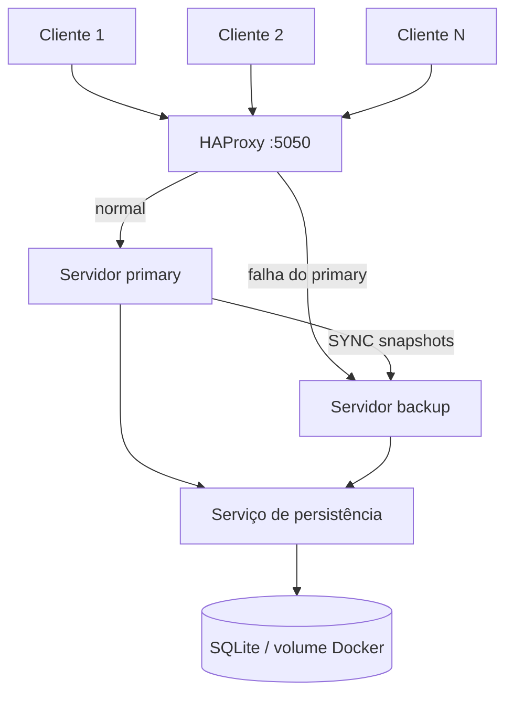

# Relatório técnico — Jogo da Forca Distribuído

## 1. Objetivo

O sistema implementa um jogo da forca em arquitetura cliente/servidor. Vários jogadores podem se conectar simultaneamente, mas cada partida possui exatamente dois participantes. O servidor é a autoridade sobre palavra, turno, letras utilizadas, erros, resultado e revanche.

A solução inclui alta disponibilidade, reconexão de clientes, replicação de estado e persistência SQLite.

## 2. Arquitetura

### 2.1 Docker

```mermaid
flowchart TD
    C1[Cliente 1] --> H[HAProxy :5050]
    C2[Cliente 2] --> H
    CN[Cliente N] --> H
    H -->|normal| P[Servidor primary]
    H -->|falha do primary| B[Servidor backup]
    P -->|SYNC snapshots| B
    P --> D[Serviço de persistência]
    B --> D
    D --> S[(SQLite / volume Docker)]
```

O cliente usa um único endpoint. Quando o principal cai, a conexão TCP existente termina e o cliente reconecta. O HAProxy direciona a nova conexão ao reserva.

### 2.2 VMs

A alternativa com Vagrant/VirtualBox utiliza Keepalived/VRRP e um IP virtual `192.168.56.100`. O comportamento da aplicação é o mesmo: após a queda da conexão, o cliente reconecta e apresenta o token anterior.

## 3. Servidor e concorrência

`GameServer` aceita conexões e executa cada cliente em uma tarefa do `ExecutorService`.

A sala de espera utiliza `BlockingQueue<Player>`. O emparelhador escolhe dois jogadores válidos e cria uma `GameSession`.

Cada partida mantém:

- palavra e categoria;
- dois jogadores/tokens;
- erros separados;
- letras já utilizadas;
- índice do turno;
- status e vencedor;
- versão monotônica;
- instante de início do turno.

## 4. Semáforo

Cada `GameSession` possui `Semaphore(1, true)`. Os métodos que modificam o estado adquirem o semáforo antes de validar e executar a jogada e liberam no `finally`.

Além da exclusão mútua, o servidor testa se o emissor é `players[turnIndex]`. Uma requisição recebida fora do turno não modifica o estado e recebe `ERROR`.

O `ReentrantLock stateLock` protege a montagem e transmissão do snapshot para impedir leitura concorrente inconsistente.

## 5. Estado e dois bonecos

Os dois jogadores possuem contadores independentes de erro. Uma jogada incorreta incrementa somente `player.errors` do autor da jogada.

Depois da alteração, `broadcast` monta uma única mensagem `STATE` contendo os dois nomes e os dois contadores e envia exatamente esse estado aos dois clientes. Por isso, ambos enxergam os dois bonecos, mas somente o boneco do jogador que errou avança.

## 6. Protocolo

O protocolo é textual, uma mensagem por linha. Campos livres usam Base64 URL-safe.

| Direção | Mensagem | Finalidade |
|---|---|---|
| cliente -> servidor | `HELLO|nomeBase64|token` | entrar/reconectar |
| servidor -> cliente | `WELCOME|token|NEW` | identidade |
| servidor -> cliente | `WAITING|...` | sala de espera |
| cliente -> servidor | `GUESS|letraBase64` | letra |
| cliente -> servidor | `WORD|palavraBase64` | palavra inteira |
| cliente -> servidor | `REPLAY` | revanche |
| cliente -> servidor | `QUIT` | abandono |
| servidor -> ambos | `STATE|...` | estado completo |
| primary -> backup | `SYNC|segredo|snapshot` | replicação |

## 7. Alta disponibilidade

Após cada modificação válida, o servidor cria um `GameSnapshot`. No modo primary, ele envia esse snapshot ao reserva por TCP.

O snapshot contém dados suficientes para reconstruir a `GameSession`: palavra, categoria, tokens, nomes, erros, letras, turno, status, vencedor e versão.

Se o primary cair:

1. a conexão TCP dos clientes é encerrada;
2. o cliente entra no laço automático de reconexão;
3. o HAProxy seleciona o backup (ou, nas VMs, o Keepalived transfere o IP virtual);
4. o cliente envia `HELLO` com seu token antigo;
5. o reserva associa o token ao jogador replicado;
6. envia o estado atual e a partida continua.

## 8. Persistência

No modo Docker, `database/db_service.py` expõe uma API HTTP local e usa SQLite.

### Tabelas

`matches` mantém o último snapshot de cada partida. `snapshot_history` registra as versões recebidas para auditoria/demonstração.

O Java envia os snapshots de forma assíncrona. Na inicialização, caso `--db-url` esteja configurado, o servidor consulta `/snapshots` e restaura partidas com status `PLAYING`.

O jogo não depende do banco para processar uma jogada: se a persistência estiver temporariamente indisponível, a partida e a replicação continuam. Isso evita transformar o banco em requisito de disponibilidade para cada requisição.

## 9. Cliente

`GameLauncher.java` oferece interface Swing. Ele não escolhe palavra, não calcula vitória e não altera erros localmente. O cliente envia comandos e redesenha a tela a partir de `STATE`.

A interface apresenta os dois jogadores, ambos os bonecos, categoria, palavra, letras utilizadas, mensagem e turno.

O modo solo também preserva a arquitetura: o bot é um segundo cliente TCP e não acessa `GameSession` diretamente.

## 10. W.O. e timeouts

Um `ScheduledExecutorService` executa o watchdog:

- `QUIT`: W.O. imediato;
- desconexão além de `--grace`: W.O.;
- jogador sem jogar além de `--turn-timeout`: W.O.;
- durante failover, o backup só ativa essa cobrança depois de receber o primeiro cliente.

## 11. Testes

`tests/integration_test.py` abre sockets e processos reais e valida:

- quatro jogadores;
- duas partidas independentes;
- dois jogadores por partida;
- recusa fora do turno;
- estados iguais;
- erros individuais;
- persistência;
- replicação;
- queda do primary;
- continuidade no backup;
- restauração a partir do SQLite após reinício dos servidores.

`tests/walkover_test.py` valida timeout e abandono voluntário.

`java client/GameLauncher.java --network-check` valida o cliente gráfico/bot contra servidores reais.

## 12. Limitações

- a replicação é assíncrona; uma queda no intervalo entre uma jogada e a entrega do snapshot pode perder a atualização mais recente;
- o banco SQLite é persistente, mas não é um cluster de banco de dados;
- a chave de replicação é compartilhada e não usa TLS;
- para produção seriam recomendados TLS, autenticação forte, observabilidade e um mecanismo de consenso/log durável.

Essas limitações são transparentes e não impedem a demonstração dos requisitos acadêmicos propostos.

## Correções de consistência e concorrência

- O prazo do turno é validado dentro da mesma região crítica (`Semaphore` + `stateLock`) da jogada; o watchdog é apenas uma segunda proteção.
- `turnStartedAt` faz parte do snapshot e não é alterado na promoção do reserva.
- O reserva só aceita clientes após perder heartbeats do primário por um intervalo configurado; antes disso responde como standby e fecha a conexão.
- `STATE` inclui os tokens dos dois jogadores, evitando ambiguidade quando os nomes são iguais.
- `replayReady` e o token do último autor de jogada são replicados.
- No modo online a GUI não inicia servidores locais automaticamente; falha de infraestrutura fica visível.
- Nas VMs, a replicação é bidirecional e o primário possui atraso de preempção para receber o estado mais recente antes do failback.
